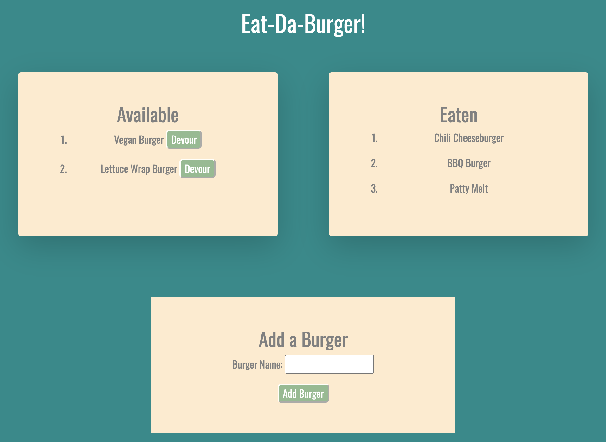

# EatingBurgers
#### This application logs burgers and allows users to "eat" them.

### This project involves a complex files structure which allows for proper access and manipulation of a MySQL database, which will be displayed using handlebars files. As the database is updated, the modified version will be shown right in the browser. When the user adds a burger, they will be allowed to "devour" it. Once they have done so, it will be moved from the "Available" section, to the "Eaten" section. 

### Link to deployed application: [Eat-Da-Burger](https://shrouded-harbor-66405.herokuapp.com/)
### 
